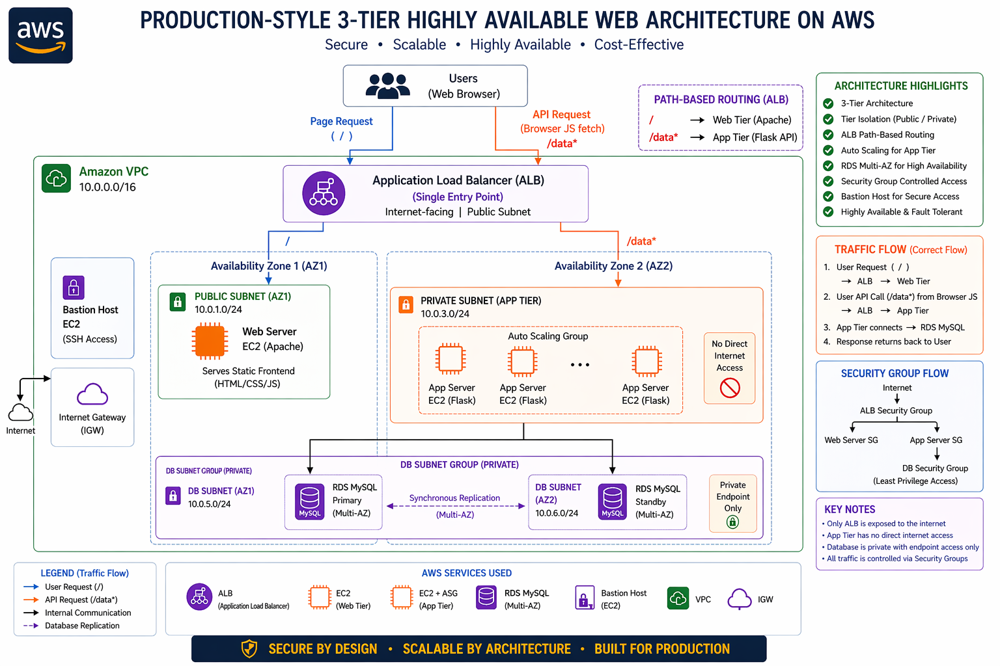

# 🚀 Production-Style 3-Tier Web Architecture on AWS

> A production-style, highly available, secure, and scalable 3-tier web architecture built on AWS using EC2, ALB, Auto Scaling Group, RDS Multi-AZ, and VPC networking.

This project demonstrates how real-world cloud systems are designed with proper networking, security, fault tolerance, and end-to-end request flow understanding.

---

## 📌 Project Overview

This architecture is built using:

* **Application Load Balancer (ALB)** as the single public entry point
* **Web Tier (Apache on EC2)** serving the frontend
* **App Tier (Flask API on EC2)** handling backend logic
* **Auto Scaling Group (ASG)** for backend scalability
* **Amazon RDS MySQL (Multi-AZ)** for highly available database design
* **Bastion Host** for secure SSH access to private resources
* **Custom VPC with Public + Private Subnets** for strong network isolation

---

## 🧠 Most Important Learning (Core Concept)

> Backend servers inside private subnets cannot be accessed directly from the browser.

### ❌ Wrong Assumption

```text id="a1"
Browser → App Server (Private IP)
```

### ✅ Correct Flow

```text id="a2"
Browser → ALB → Web Tier (/)
Browser → ALB → App Tier (/data)
```

### Why?

* API calls originate from **browser JavaScript (`fetch()`)**
* Backend is deployed inside a **private subnet**
* ALB acts as the trusted internal entry point

This was the biggest architectural learning in the project.

---

## 🏗️ Architecture Diagram



---

## 🔁 End-to-End Request Flow

### Step 1 — Frontend Access

```text id="a3"
User → Browser → ALB → Web Tier
```

The frontend static page is served from Apache running on EC2.

---

### Step 2 — Backend API Call

```text id="a4"
Browser JavaScript → ALB → App Tier (/data)
```

The `fetch()` function sends request to the backend through ALB.

---

### Step 3 — Database Access

```text id="a5"
App Tier → Amazon RDS MySQL
```

Flask connects to RDS securely using private networking.

---

### Step 4 — Response Returned

```text id="a6"
RDS → App Tier → ALB → Browser
```

The browser displays:

```text id="a7"
DB connection successful!
```

---

## ⚙️ Tech Stack

### AWS Services

* EC2
* Application Load Balancer (ALB)
* Auto Scaling Group (ASG)
* Amazon RDS MySQL (Multi-AZ)
* VPC
* Public & Private Subnets
* Security Groups
* NAT Gateway
* Bastion Host

### Application Stack

* Apache HTTP Server
* Python Flask
* MySQL Connector
* HTML / CSS / JavaScript

---

## 🔐 Security Design

### Internet Access

Only the **Application Load Balancer (ALB)** is publicly accessible.

---

### Private Infrastructure

* App Tier runs inside private subnets
* Database runs inside private DB subnets
* No direct browser access to backend or database

---

### Secure SSH Access

```text id="a8"
Local Machine → Bastion Host → Private EC2
```

Bastion host provides controlled access to internal servers.

---

### Security Group Flow

```text id="a9"
Internet → ALB SG  
ALB → Web SG  
ALB → App SG  
App → RDS SG
```

This follows least-privilege access design.

---

## 🌐 Frontend (Web Tier)

### Hosted Using

* Apache on EC2
* Public subnet deployment

### Functionality

* Static landing page
* “Test Backend” button
* JavaScript `fetch()` API call

### Example

```javascript id="a10"
fetch("http://ALB-DNS/data")
  .then(response => response.text())
  .then(data => {
    document.getElementById("output").innerText = data;
  });
```

### Key Learning

Frontend never directly contacts backend EC2.
All requests go through ALB.

---

## ⚙️ Backend (App Tier)

### Built Using

* Python Flask
* Port 8000
* Private subnet deployment

### API Endpoint

```text id="a11"
/data
```

### Example

```python id="a12"
@app.route("/data")
def get_data():
    connection = mysql.connector.connect(
        host="RDS-ENDPOINT",
        user="admin",
        password="password",
        database="dbname"
    )
    return "DB connection successful"
```

### Critical Learning

Target group port must match Flask app port.

```text id="a13"
Flask → 8000  
Target Group → 8000
```

Mismatch causes unhealthy targets and 502 errors.

---

## 🗄️ Database (RDS Layer)

### Database Used

* Amazon RDS MySQL
* Multi-AZ deployment

### Why Multi-AZ?

* High availability
* Automatic failover
* Fault tolerance across Availability Zones

### DB Subnet Group

```text id="a14"
AZ1 → 10.0.5.0/24  
AZ2 → 10.0.6.0/24
```

### Security

Database is private and accessible only from App Tier.

---

## 📸 Project Execution Proof

Step-by-step execution screenshots are available inside:

📂 [`screenshots/`](./screenshots)

Includes:

* Bastion SSH access
* Web → App communication
* App → DB success
* ALB healthy targets
* Auto Scaling instances
* Multi-AZ proof
* Final end-to-end success

---

## 📘 Full Documentation

Detailed project documentation is available here:

📂 [`documentation/`](./documentation)

Includes:

* Full architecture explanation
* Frontend + Backend implementation
* Debugging journey
* Problems faced + solutions
* Interview preparation questions

---

## 💥 Problems Faced & Solutions

### Problem 1 — Backend Not Reachable

### Cause

ALB path routing for `/data` was missing.

### Fix

Configured:

```text id="a15"
/ → Web Tier  
/data* → App Tier
```

---

### Problem 2 — Wrong Frontend → Backend Understanding

### Wrong Thought

```text id="a16"
Web Server → App Server
```

### Correct Learning

```text id="a17"
Browser → ALB → App Tier
```

---

### Problem 3 — Target Group Unhealthy

### Cause

Port mismatch

### Fix

Matched Flask port and target group port.

```text id="a18"
8000 = 8000
```

---

## 🎯 Interview-Focused Concepts

This project helps explain:

* Why private subnets exist
* Why ALB is required
* Difference between ALB and ASG
* Why ASG is placed only on App Tier
* Why browser cannot directly access backend
* Importance of `host=0.0.0.0` in Flask
* Why target group health checks fail

---

## 🚀 Future Improvements

Possible next upgrades:

* CloudFront + S3 for modern frontend hosting
* HTTPS using ACM + Route 53
* CI/CD pipeline using GitHub Actions
* Docker containerization
* ECS / EKS migration
* Monitoring using CloudWatch

---

## 👨‍💻 Author

**Adhithyan Sivaraman T**

### Connect With Me

* GitHub: https://github.com/Adhithyan-10
* LinkedIn: [www.linkedin.com/in/adhithyan-sivaraman-t-399b5b362](http://www.linkedin.com/in/adhithyan-sivaraman-t-399b5b362)

---

## ⭐ Final Note

This project is not just about deploying AWS resources.

It demonstrates:

* Real architecture understanding
* Secure cloud design
* Production-style deployment thinking
* Debugging and problem-solving ability

> From confusion → to clear cloud architecture understanding.

If you found this project valuable, consider giving it a ⭐
